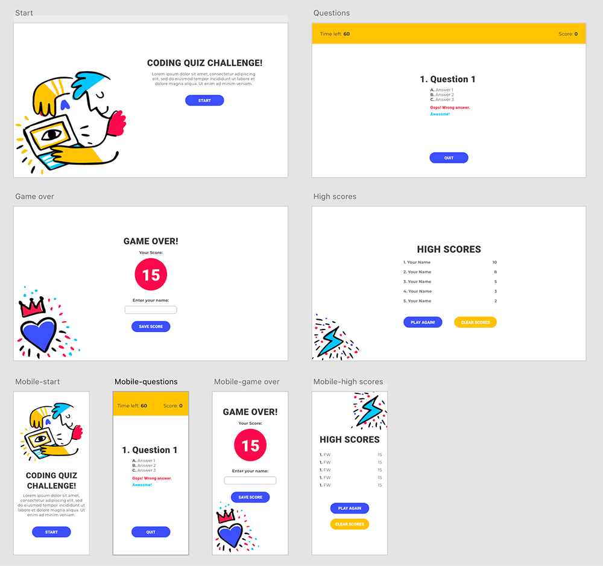

# Fun Code Quiz!
Time to test your knowledge! This online quiz game gives you 60 seconds to answer as many questions as you can, and save your score to the High Scores board after. Correct answers increase your score but careful! Incorrect answers will decrease the time left by 5 seconds.
[See deployed application.](https://ferwicker.github.io/code-quiz/)

## Table of contents
  - [Motivation](#motivation)
  - [Process](#process)
  - [Features](#features)
  - [Credits](#credits)

## Motivation
The aim of this project is to build a fun adn easy to use quiz to gamify learning of HTML, CSS and Javascript. The High Scores function helps make this even more fun by allowing the user to compete with friends for the highest score! 

## Process
The creation process for this project was broken down into the following steps:
  

<b>Brainstorming and paper sketching of ideas</b>

As with every project, the first step is doing some brainstorming about possible approaches and putting some ideas down on paper as rough (very rough!) sketches.

This step is essential to create a roadmap for the rest of the project's development, and to get an idea of what the layout will look like.

  

<b>Design mockup on Adobe XD</b>

  
As a designer,this is the most fun part! It is where I get to define what the final project will look like (although it is open to changes as becomes necessary). In this step I experiment with colours, images and layouts before ever writing a line of code, and save a ton of time!

  
For this project, I used a mobile-first approach for the design to make the coding of the responsive app easier.

   
  
  

<b>HTML and CSS development</b>

  
With the design set up, the HTML and CSS building was pretty straight forward. The approach used was that of multiple sections (one for each 'screen') overlapping each other and toggling 'display: none' to switch between them. Most HMTL elements needed for the application were built in this step, although the approach for the 'Questions' section changed a couple times as we will see in the next step.

  

<b>Javascript development</b>

  The main challenge during this step was the questions displaying and being checked. Although the initial working application used a form with radio buttons and a 'Next' button, the final version uses dynamically modified HTML and event listeners on the answers themselved to check. This simplifies the user experience and allows for faster play.
 
  
  

<b>Testing and adjusting</b>

  The application was tested and adjusted as needed throughout the process and after, both for functionality and mobile responsiveness.
  
 
  

## Features
The quiz has a 60 second timer and score counter. When a user chooses the correct answer, the score goes up by one, when the answer is wrong, the time left decreases by 5 seconds. At the end of the quiz, the user inputs their name to save the score to local storage and the High Scores are displayed on the screen. The user can clear the scores or play again.

### [See deployed application](https://ferwicker.github.io/code-quiz/)

## Credits
The illustrations used in the quiz are from the [Miroodles Collection by Pablo Stanley](https://blush.design/collections/miroodles) from the awesome illustration resource library [Blush](https://blush.design/). The colour scheme was also inspired by the illustrations.

The questions for the quiz were sourced from [W3Schools Quizzes](https://www.w3schools.com/quiztest/).

Some valuable tutorials that were helpful during the development of this application are:
[Get Value of Selected Radio Button](https://www.dyn-web.com/tutorials/forms/radio/get-selected.php) and
[JavaScript Array of Objects Tutorial](https://www.freecodecamp.org/news/javascript-array-of-objects-tutorial-how-to-create-update-and-loop-through-objects-using-js-array-methods/)